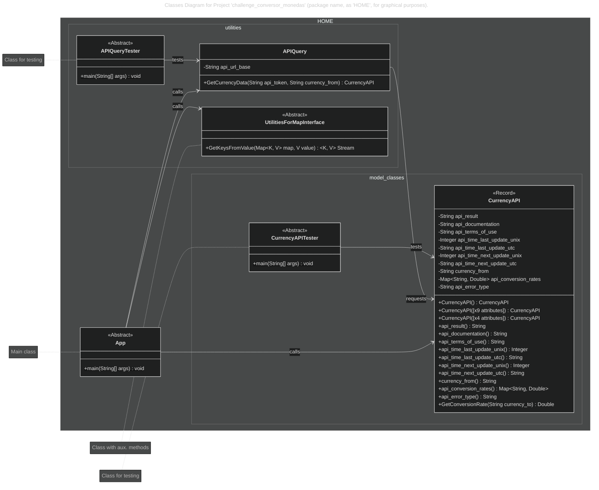
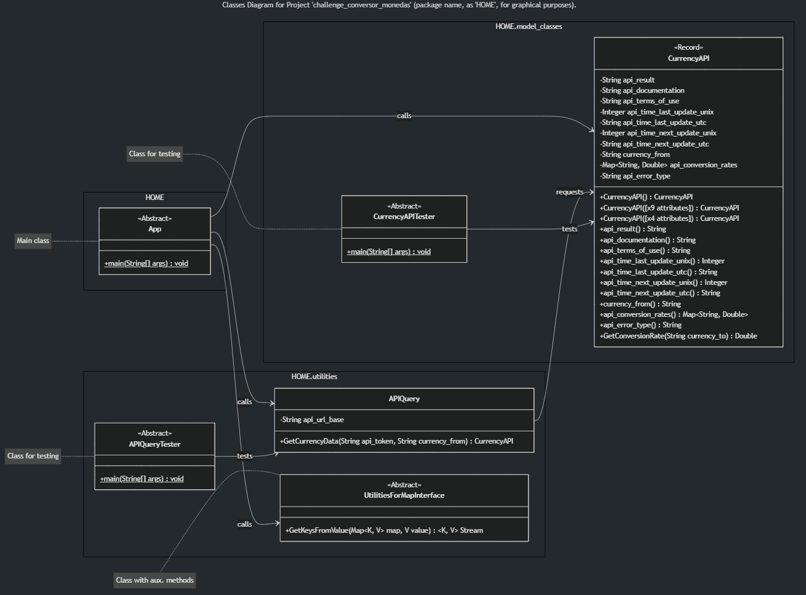

<!-- Badges:
- Source: 'https://shields.io/docs/static-badges', 'https://shields.io/badges/static-badge'.
- HTML structure followed: 'https://github.com/facebook/docusaurus/blob/main/README.md?plain=1'.
- Badges with logos: 'https://shields.io/docs/logos', 'https://simpleicons.org/', 'https://github.com/simple-icons/simple-icons/blob/master/slugs.md'.
- HTML <a> tag not redirecting: 'https://stackoverflow.com/questions/8260546/make-a-html-link-that-does-nothing-literally-nothing/8260561#8260561', 'https://www.geeksforgeeks.org/html/how-to-create-html-link-that-does-not-follow-the-link/'.
-->

<!-- Badge: WIP

  

 -->
<!--
🚧 WIP: section under construction. 🚧
-->

<!-- Badge: Done -->

  

<!-- README structure followed:
- 'https://www.aluracursos.com/blog/como-escribir-un-readme-increible-en-tu-github/'.
- 'https://github.com/camilafernanda/GlicoCare/'.
- 'https://github.com/nasa/openmct/'.
- 'https://github.com/facebook/docusaurus'.
-->

# Practicando con Java.

<!--
Enable autoplay of animated images:
- 'https://stackoverflow.com/questions/72508378/enable-gif-autoplay-on-github-readme/72509078#72509078'.
- 'https://github.com/orgs/community/discussions/47709'.
- 'https://github.com/settings/accessibility'.
Image width for GitHub READMEs:
- 'https://github.com/orgs/community/discussions/42424'.
- 'https://gist.github.com/uupaa/f77d2bcf4dc7a294d109'.
-->
<!-- 

    
     
    <figcaption><small>Fig.</small></figcaption>
     

  -->

    
     
    <figcaption><small>Fig. Code execution in VS Code, of Java app in folder 'challenge_conversor_monedas'.</small></figcaption>
     

Final delivery of the 5th course: '[Practicando con Java: Challenge Conversor de Monedas](https://app.aluracursos.com/course/practicando-java-con-conversor-de-moneda)', from module (a.k.a. 'formación' in spanish) '[Java Orientado a Objetos G9 - ONE](https://app.aluracursos.com/formacion-java-grupo9-one)', of [Alura LATAM](https://www.aluracursos.com/). <b>Part of [ORACLE Next Education (ONE)](https://www.oracle.com/co/education/oracle-next-education/) education program, in LATAM</b>.

<!-- Callouts:
- Improved format taken from examples in 'https://github.com/nasa/openmct/blob/master/README.md?plain=1'.
-->
> [!NOTE]
> This README is **mainly** written in english (en), but it might have some sections in spanish (sp), since course content is in spanish.

# ℹ About.

The course covered topics such as:

- Use of free API ExchangeRate, to get currency conversion rates: '<https://www.exchangerate-api.com/>'.
    - You can choose between a limited open access vs. creating a free account: '<https://www.exchangerate-api.com/docs/free>'.
- Connection with APIs (**Application Programming Interface**) and practicing how to connect to them.
    - Use of HTTP protocol.
    - Understanding responses in JSON format.
- Getting to know tools for developing and testing APIs, such as:
    - Postman: '<https://www.postman.com>'.
    - Insomnia: '<https://insomnia.rest>'.
    - Apidog: '<https://apidog.com>'.
- Understanding the HTTP (**HyperText Transfer Protocol**) protocol:
    - Communication model of client-server.
    - Common methods: GET, POST, PUT, DELETE.
    - Statuses: 1xx (informative), 2xx (success), 3xx (redirects), 4xx (client's errors), 5xx (server's errors).
- Using Java packages / libraries to manage API connections: HTTP requests, and JSONs responses.
    - HTTP requests: `java.net` library (`HttpClient`, `HttpRequest`, `URI`, `HttpResponse`).
        - Documentation for reference: '<https://docs.oracle.com/en/java/javase/17/docs/api/java.net.http/java/net/http/package-summary.html>'.
    - JSON conversion (serialization and de-serialization) from and to Java objects: `com.google.gson` library (`Gson`, `GsonBuilder`).
        - Documentation for reference: '<https://github.com/google/gson>', '<https://www.javadoc.io/doc/com.google.code.gson/gson/latest/com.google.gson/module-summary.html>'.
- Use of Java `Record`s, as an 'intermediate' class to facilitate managing mapping of JSON fields from responses to project's classes and attributes: '<https://docs.oracle.com/en/java/javase/16/language/records.html>'.
- Use of `Exceptions` to handle possible errors in code execution.
    - Use of `try-catch` blocks vs. `throws` keyword in class definition: '<https://medium.com/@AlexanderObregon/java-exception-handling-throws-vs-try-catch-94b0abe1080d>'.
    - Understanding exceptions hierarchy: `Throwable` < `Error` | (`Exception` < `RuntimeException`). **This implies to start `catch`es with more specific exceptions, until you get to the more 'general' (or superclass)**; e.g. `RuntimeException` BEFORE `Exception`.
    - Using 'multi-catch' to group catch of several types of exceptions.
- Using `var` as a short kewyword for declaring attributes and variables.
- Getting to know **'Javadocs'**; i.e. documentation specific for each Java version, referring methods, classes, interfaces, etc. E.g. *Javadoc 17*: '<https://docs.oracle.com/en/java/javase/17/docs/api/index.html>'.
- Implementing custom **constructors** for classes (specially `Record`s): *'predetermined'* (**without parameters**), and additionals such as canonicals or compacts (alternate to canonical; i.e. explicitly declare ALL arguments).
- Working with [Class Diagrams](https://www.geeksforgeeks.org/system-design/unified-modeling-language-uml-class-diagrams/) to define appropiate 'Astraction'.

## 🥇 Course Certificate of Completion.

Available at '<https://app.aluracursos.com/certificate/ef01ee66-eb31-4a59-a978-612dd84f01f9>'.

- Estimated workload: 10h.
- Activities: 10.
- Topics:
    1. 'Sobre los Challenges'.
    2. 'Construye tu Conversor de Moneda'.
    3. 'Entrega del Challenge'.

## 🔗 Links to program resources.

**PROGRAM STRUCTURE.**

- <b>*[Course]* 'Practicando con Java: Challenge Conversor de Monedas'</b>: '<https://app.aluracursos.com/course/practicando-java-con-conversor-de-moneda>'.
- *[Module]* 'Java Orientado a Objetos G9 - ONE': '<https://app.aluracursos.com/formacion-java-grupo9-one/>'.
- **ORACLE Next Education (ONE) education program, in LATAM**: '<https://www.oracle.com/co/education/oracle-next-education/>'.
- Alura LATAM education platform: '<https://www.aluracursos.com/>'.

**COURSE RESOURCES.**

<!-- - GitHub's project repository: '<https://github.com/>'. -->
- Trello's project schedule guide: '<https://trello.com/b/RU41cvaQ/conversor-de-moneda-challenge-one-java-back-end>'.
- API's webpage: '<https://www.exchangerate-api.com/>'.

# 🐾 Notes About Project.

> [!NOTE]
> This section is only for reference, for documentation purposes in case of re-visiting course notes.

## Code Execution.

You can run the code **straight out-of-the-box** (almost\*) by cloning this repo. and running the Java project with it's entry class [`App.java`](./challenge_conversor_monedas/src/main/java/a1t0ghb/courses_oracle_one/challenge_conversor_monedas/App.java).

\*The **only pre-configuration required** is your input of your [ExhangeRate key / access token](https://app.exchangerate-api.com/sign-up). In order to do so, please follow instructions:

- After cloning this repo., go to file [`input_secrets-TEMPLATE.yaml`](./challenge_conversor_monedas/src/main/resources/input_secrets-TEMPLATE.yaml), set your key / token; e.g. `_EXCHANGERATE_API_TOKEN: 'abc123'`, and save the file.
- Rename the file to `input_secrets.yaml`.

## Class Diagram.

[Class Diagram](https://www.geeksforgeeks.org/system-design/unified-modeling-language-uml-class-diagrams/) of project with Object Oriented Programming (OOP) approach, in folder: [`challenge_conversor_monedas`](./challenge_conversor_monedas).

> [!NOTE]
> This diagram was made using Mermaid.js in markdown files: 'https://docs.mermaidchart.com/mermaid-oss/syntax/classDiagram.html'. **For using it in VS Code, ⚠ it requires an extension for rendering ⚠**, such as 'Markdown Preview Mermaid Support' 'https://marketplace.visualstudio.com/items?itemName=bierner.markdown-mermaid'.

    
<i>Please click here to expand, in case previous diagram (in Mermaid.js) doesn't render</i>.

     
    

        
    

 

Notes:

- Class `App` is the **main class**, which calls first `APIQuery`. The later class is the one **responsible for making API calls** via HTTP requests.
    - Only after a sucessful call to the API, `App` calls methods on the record (class) `CurrencyAPI`.
- Classes with the word `Tester` at the end, such as `APIQueryTester` and `CurrencyAPITester`, are **exclusively for quick / fast / on-the-go testing** of methods of instances of their corresponding classes.
- Class `UtilitiesForMapInterface` is just helper class with auxiliary methods related to instances implementing a `Map` Interface.

<!-- Embed dynamic content (image) of contributors:
- 'https://dev.to/lacolaco/introducing-contributors-img-keep-contributors-in-readme-md-gci'.
- 'https://contrib.rocks/'.
-->
# 🤝 Contributors.

Made with [contrib.rocks](https://contrib.rocks).

<!-- Authors table structure
- From repo: 'https://github.com/camilafernanda/GlicoCare/blob/main/README.md?plain=1'.
-->
# 📜 Authors.

| [ a1t0ghb](https://github.com/a1t0ghb) |
| :---: |
<!-- EOF. -->